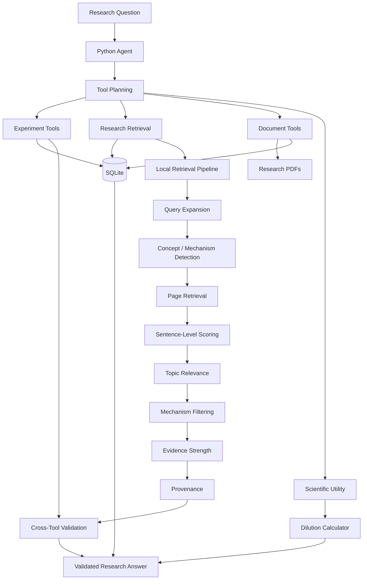

# Biomedical Research MCP Server

[](https://github.com/shaiksameer667ss-prog/biomedical-ai-mcp/actions/workflows/tests.yml)
[](https://www.python.org/)
[](https://py.sdk.modelcontextprotocol.io/)

A biomedical research assistant built around the **Model Context Protocol (MCP)**.

The project combines structured biomedical experiment data, research-document ingestion, local evidence retrieval, validation, provenance tracking, and scientific utility tools into an MCP-based workflow.

> **Portfolio project:** This is a research-assistance and software-engineering project, not a clinical decision-support system.

## Why this project?

Biomedical research questions often require several different operations:

- finding structured experiment records
- inspecting research documents
- extracting evidence from PDFs
- matching evidence to the requested treatment or model
- showing where evidence came from
- avoiding unsupported combinations of unrelated findings

This project demonstrates how MCP tools can expose those capabilities to a Python agent while keeping validation, retrieval, and provenance logic explicit.

## Key capabilities

- Structured biomedical experiment search using SQLite
- Experiment retrieval and insertion
- Research-document registration
- PDF text extraction with resource limits
- Page-level research-content search
- Local mechanism-focused evidence retrieval
- Evidence-strength classification
- Evidence provenance chains
- Multi-tool question planning
- Cross-tool treatment/cell-model/duration/mechanism alignment
- Dilution calculation
- Input and SQL safety controls
- Environment-based configuration
- Automated testing with GitHub Actions
- Locked Python dependencies with `uv.lock`

The current retrieval workflow is fully local and does not require a paid external embedding API.

---

## Architecture



### Architecture layers

| Layer | Responsibility |
|---|---|
| Python agent | Interprets questions and plans one or more MCP tool calls |
| MCP server | Exposes tools and research resources |
| SQLite | Stores experiment and research-document data |
| Document layer | Registers PDFs and stores extracted page content |
| Retrieval layer | Performs local query expansion, scoring, and mechanism filtering |
| Validation layer | Checks topic and experimental-context alignment |
| Provenance layer | Reports document, page, sentence, mechanism, and retrieval scores |
| CI/test layer | Verifies production-hardening behavior automatically |

See [`docs/architecture.md`](docs/architecture.md) for a more detailed component view.

---

## MCP server

The server exposes tools and resources for biomedical research workflows.

### Tools

| Tool | Purpose |
|---|---|
| `calculate_dilution` | Calculate stock and diluent volumes using the dilution equation |
| `get_experiment` | Retrieve an experiment by ID |
| `search_experiments` | Search experiments using text and structured filters |
| `add_experiment` | Add a validated experiment record |
| `get_research_document` | Retrieve research-document metadata |
| `add_research_document` | Register a research document |
| `extract_pdf_text` | Extract and store PDF text and page content |
| `get_research_content` | Retrieve extracted document content |
| `search_research_content` | Search extracted research content |
| `search_research_evidence` | Retrieve mechanism-focused evidence for a research question |

### MCP resources

```text
research://experiments
research://experiments/{experiment_id}

research://documents
research://documents/{document_id}
research://documents/{document_id}/content
research://documents/{document_id}/pages/{page_number}
```

---

## Research retrieval pipeline

The retrieval workflow is designed to avoid treating every text match as scientific evidence.

```text
Research Question
       |
       v
Query expansion
       |
       v
Concept / mechanism detection
       |
       v
Page retrieval
       |
       v
Sentence-level evidence scoring
       |
       v
Topic relevance validation
       |
       v
Mechanism-specific filtering
       |
       v
Evidence strength classification
       |
       v
Provenance
```

### Evidence strength

The system distinguishes:

- **DIRECT** — the requested topic and mechanism are explicitly supported by the evidence sentence.
- **SUPPORTING** — the mechanism is explicit, while part of the topic linkage comes from page context.
- **WEAK/INDIRECT** — the mechanism is explicit but the requested topic linkage is limited.

The output can include:

- document ID
- page number
- evidence sentence
- mechanism
- evidence strength
- retrieval score
- direct-topic score
- page-topic score
- provenance chain

---

## Cross-tool validation

When a question requires both experiment data and research evidence, the agent checks alignment across:

- treatment
- cell model
- duration
- mechanism

Example:

```text
Experiment:
  Treatment = Doxorubicin
  Cell model = Liver Cells
  Duration = 48 hours

Retrieved research evidence:
  Treatment = Copper Nanoparticles

Result:
  NOT ALIGNED
```

The agent does not silently present the copper-nanoparticle evidence as support for the doxorubicin experiment.

Possible alignment outcomes:

```text
MATCH
PARTIALLY ALIGNED
NOT ALIGNED
NOT CONFIRMED
```

This is a transparent consistency check, not independent scientific validation.

---

## Security and production hardening

The server includes defensive controls for:

- input validation
- question length limits
- tool-argument length limits
- search-result limits
- evidence `top_k` limits
- experiment field limits
- document title/description limits
- document ID validation
- PDF filename validation
- PDF type validation
- path traversal protection
- absolute-path rejection
- document-directory containment checks
- PDF file-size limits
- extracted-text limits
- page-text limits
- SQLite identifier allowlisting
- parameterized SQL values
- generic public error messages
- internal error logging
- environment-based configuration

The test suite also exercises PDF resource limits, SQL/input safety, configuration behavior, alignment logic, and error-safety behavior.

---

## Project structure

```text
biomedical-ai-mcp/
|
|-- server.py
|-- agent.py
|-- retrieval.py
|-- database.py
|-- config.py
|-- test_database_setup.py
|-- run_all_tests.py
|
|-- pyproject.toml
|-- uv.lock
|-- README.md
|-- CONTRIBUTING.md
|-- LICENSE
|-- .env.example
|-- .gitignore
|
|-- .github/
|   `-- workflows/
|       `-- tests.yml
|
|-- documents/
|   `-- copper_nanoparticle_study.pdf
|
|-- docs/
|   `-- architecture.md
|
`-- test_*.py
```

Local runtime data such as `biomedical.db` and research PDFs are intentionally ignored by Git.

---

## Requirements

Recommended environment:

- Windows
- Python 3.14
- `uv`
- MCP Python SDK 2.1.1
- SQLite
- Node.js only if using optional Claude Code tooling

Dependencies are pinned in `pyproject.toml` and `uv.lock`.

The current local retrieval workflow does not require a paid LLM or paid embedding API.

---

## Installation

Clone the repository:

```bash
git clone https://github.com/shaiksameer667ss-prog/biomedical-ai-mcp.git
cd biomedical-ai-mcp
```

Create/sync the environment:

```bash
uv sync --locked
```

If `uv` is not installed, install it first from the official `uv` documentation.

---

## Running the MCP server

For MCP development and inspection:

```bash
uv run mcp dev server.py
```

The MCP Inspector should connect to the server and expose the available tools and resources.

For direct stdio execution:

```bash
uv run python server.py
```

The server uses the MCP SDK's asynchronous stdio runner.

---

## Running the research agent

Start the Python agent:

```bash
uv run python agent.py
```

Example questions:

```text
Which experiments used liver cells?

Which experiment tested doxorubicin on liver cells for two days?

What mechanisms are involved in copper nanoparticle toxicity?

Show me the research document.

Which experiment tested doxorubicin on liver cells for two days,
and what does the research document say about the mechanisms of toxicity?
```

For combined questions, the agent can execute multiple MCP tools and then perform cross-tool relevance/alignment checks.

---

## Example MCP workflow

A combined research question follows this pattern:

```text
User question
     |
     v
Agent identifies required tools
     |
     +--> search_experiments
     |
     +--> search_research_evidence
     |
     v
Compare experiment and evidence context
     |
     v
Check treatment / cell model / duration / mechanism
     |
     v
Return findings with evidence provenance
```

Example:

```text
Question:
Which experiments involve copper nanoparticles, and what mechanisms
of toxicity are described in the research document?
```

Expected workflow:

1. Search structured experiments for copper-nanoparticle treatment.
2. Retrieve mechanism-focused evidence from the research document.
3. Compare the treatment and model context.
4. Report evidence strength and provenance.
5. Clearly identify any mismatch instead of overclaiming.

---

## Running tests

Run the complete test suite:

```bash
uv run python run_all_tests.py
```

Current baseline:

```text
Ran 70 tests
OK
```

GitHub Actions runs the same test suite on pushes to `main` and pull requests targeting `main`.

The workflow uses the locked dependency set:

```text
uv sync --locked
uv run python run_all_tests.py
```

A syntax check can also be run with:

```bash
uv run python -m py_compile server.py
```

---

## Configuration

The application reads configuration from process environment variables.

| Variable | Purpose | Default |
|---|---|---|
| `BIOMED_MCP_SERVER_COMMAND` | MCP server command | `python` |
| `BIOMED_MCP_SERVER_SCRIPT` | MCP server script | `server.py` |
| `BIOMED_DEFAULT_DOCUMENT_ID` | Default research document | `DOC001` |
| `BIOMED_RESEARCH_TOP_K` | Number of evidence results | `5` |
| `BIOMED_MAX_QUESTION_LENGTH` | Maximum agent question length | `2000` |
| `BIOMED_LOG_LEVEL` | Logging level | `INFO` |

An `.env.example` file documents the supported variables.

> The current application reads environment variables directly; it does not automatically load a `.env` file.

Windows example:

```cmd
set BIOMED_RESEARCH_TOP_K=8
uv run python agent.py
```

---

## Current example dataset

The example database contains experiments such as:

- Cytotoxicity study using copper nanoparticles on skin cells
- Antimicrobial susceptibility study using bacterial culture
- Drug cytotoxicity study using doxorubicin on liver cells

The example research document is a review concerning manufactured copper nanoparticles and their toxicological mechanisms.

---

## Limitations

This is a portfolio and research-assistance project, not a clinical decision-support system.

Important limitations:

- Local retrieval is not equivalent to a production vector database.
- Evidence retrieval does not establish causality.
- Topic alignment is not independent scientific verification.
- The example dataset is small.
- The current system does not replace expert literature review.
- Scientific conclusions depend on the source documents available to the system.

---

## Future improvements

Planned production-oriented improvements include:

1. Cleaner package/module structure
2. Larger research-document datasets
3. Optional local embedding/vector retrieval
4. Improved document provenance
5. More robust observability
6. Authentication/authorization for network deployments
7. Containerized deployment
8. MCP/API deployment documentation
9. Retrieval evaluation datasets
10. Broader integration and end-to-end tests

Continuous integration and core production hardening are already implemented.

---

## Portfolio value

This project demonstrates practical experience with:

- Python
- MCP
- AI agent tool planning
- Retrieval-augmented research workflows
- Biomedical informatics
- SQLite
- PDF processing
- Information retrieval
- Evidence extraction
- Data validation
- Cross-tool reasoning
- Security hardening
- Configuration management
- Automated testing
- CI/CD
- Software engineering practices

---

## License

This project is intended as a portfolio/educational software project. See `LICENSE` for the current license terms.
