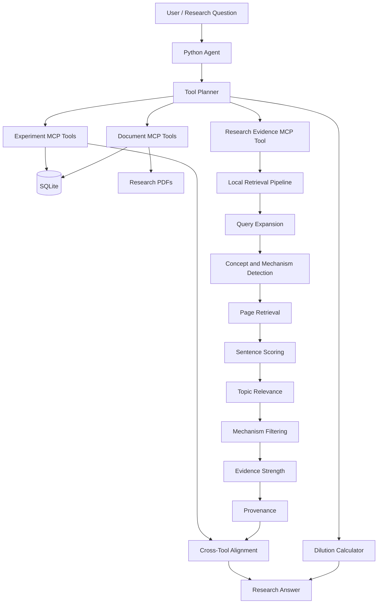

# Architecture

## High-level flow



## Components

### 1. Agent

`agent.py` is the user-facing orchestration layer.

Responsibilities:

- accept a research question
- classify the question
- identify required MCP tools
- extract structured experiment filters
- execute one or more tools
- compare results from different tools
- format evidence, alignment, and provenance

The planner can select multiple tools for a single question.

### 2. MCP server

`server.py` exposes the biomedical capabilities through MCP.

It provides:

- tools
- resources
- resource templates
- validation
- database access
- PDF ingestion
- evidence retrieval

### 3. Database

SQLite stores:

- experiment metadata
- research-document metadata
- extracted research content
- page-level research content

The application uses parameterized SQL values and allowlists dynamic SQLite identifiers.

### 4. Document ingestion

Research PDFs are registered through document metadata and then processed by `extract_pdf_text`.

The ingestion layer enforces:

- safe document IDs
- safe filenames
- document-directory containment
- file-size limits
- page-text limits
- total extracted-text limits

### 5. Local retrieval

`retrieval.py` implements the current local evidence-retrieval approach.

Pipeline:

```text
Question
   |
   v
Tokenization / keyword extraction
   |
   v
Intent detection
   |
   v
Scientific concept detection
   |
   v
Query expansion
   |
   v
Page scoring
   |
   v
Mechanism-specific sentence selection
   |
   v
Topic relevance validation
   |
   v
Evidence strength
   |
   v
Provenance
```

The current implementation deliberately avoids a paid external embedding API.

### 6. Cross-tool validation

When experiment data and document evidence are combined, the validation layer compares:

- treatment
- cell model
- duration
- mechanism

Hard mismatches in treatment or duration can make the overall result `NOT ALIGNED`.

A cell-model difference alone does not automatically invalidate evidence because research documents can discuss multiple biological models.

### 7. CI

GitHub Actions runs:

```text
Checkout
   |
   v
Python 3.14
   |
   v
uv sync --locked
   |
   v
run_all_tests.py
   |
   v
70 tests
```

The test suite creates a deterministic test database, so CI does not depend on a developer's ignored local SQLite database.

## Design principle

The central design principle is:

> Retrieve evidence, validate its context, and expose its provenance rather than silently treating retrieval as scientific truth.
